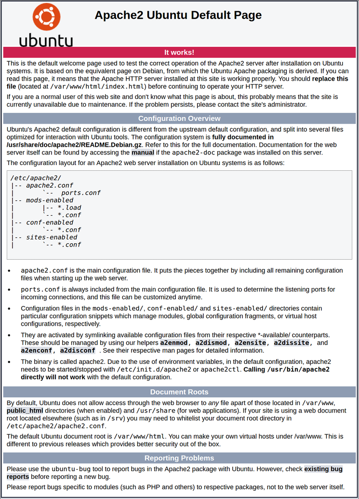

# Apache HTTP server
<a name="linux"></a>

***

# TABLE OF CONTENTS
 + 01 [ | Install Apache HTTP server](#install)
 + 02 [ | Firewall configuration ](#firewall)
 + 03 [ | Verifying Apache Web Server service ](#verify)
 + 04 [ | Default welcome page ](#default-welcome-p)
 + 05 [ | Change `localhost` to a domain name in apache HTTP server ](#cdn)
 + 06 [ | Change document *`root directory`* in apache HTTP server ](#cdr)

<a name="install"></a>
### `Apache HTTP server:` Install
We have to install Apache HTTP server in our host computer/virtual machine. The first thing we do is to update system repositories before we install apache, then we will install apache HTTP server.

*Update system repositories*

```sh

sudo apt-get update

```

*install apache HTTP server after update system repositories*

```sh

sudo apt-get install apache2

```
*` Last modified: 2023-07-09 time: 14:07PM `*

<a name="firewall"></a>
### `Apache HTTP server:` Firewall configuration
Keep in mind that the only way we can access Apache from outside we must open specific port on our system. First, we have to enable UFW (Firewall). By default firewall (UFW) is disable. secondly we list the *application profiles* that we need to give Apache access to. Then we utilize/allow "Apache full" profile for enabling network activities on port 80. We then check the status which will show Apache allowed in firewall. Lastly, we Verifying Apache service is operational. Execute command below to make apache to accessible outside sequential:

*enable UFW*
```sh

sudo ufw enable

```

*list all application profile*
```sh

sudo ufw app list

```

*utilize/allow "Apache full"*
```sh

sudo ufw allow ‘Apache full’

```

<a name="verify"></a>
### `Apache HTTP server:` Verifying Apache Web Server service

```sh

sudo systemctl status apache2

```

```sh
● apache2.service - The Apache HTTP Server
     Loaded: loaded (/lib/systemd/system/apache2.service; enabled; vendor preset: enabled)
     Active: active (running) since Wed 2021-02-24 20:39:39 UTC; 5 days ago
       Docs: https://httpd.apache.org/docs/2.4/
    Process: 115 ExecStart=/usr/sbin/apachectl start (code=exited, status=0/SUCCESS)
    Process: 15247 ExecReload=/usr/sbin/apachectl graceful (code=exited, status=0/SUCCESS)
   Main PID: 128 (apache2)
      Tasks: 6 (limit: 4672)
     Memory: 16.4M
     CGroup: /system.slice/apache2.service
             ├─  128 /usr/sbin/apache2 -k start
             ├─15254 /usr/sbin/apache2 -k start
             ├─15255 /usr/sbin/apache2 -k start
             ├─15256 /usr/sbin/apache2 -k start
             ├─15257 /usr/sbin/apache2 -k start
             └─15258 /usr/sbin/apache2 -k start

Feb 27 00:00:23 ubuntu-db-mgmnt systemd[1]: Reloaded The Apache HTTP Server.
Feb 28 00:00:23 ubuntu-db-mgmnt systemd[1]: Reloading The Apache HTTP Server.

```
As confirmed by this output above, the service has started successfully. Another approach to verify if `Apache is running fine` is to request a web page from the Apache web server. To do so, find your IP address.

```sh

hostname -I

```
*` Last modified: 2023-07-09 time: 14:11PM `*

<a name="default-welcome-p"></a>
### `Apache HTTP server:` Default welcome page
To see apache welcome page as show below, open the web browser. On the browser address bar, typein the IP address to access  or just type localhost. The page below indicates that Apache is working correctly. It also includes some basic information about important Apache files and directory locations.



*` Last modified: 2023-07-09 time: 14:12PM `*

<a name="domain-name-l"></a>
### `Apache HTTP server:` Change *localhost* to a *Domain Name*

*In this section,* we want to change *localhost DN* to access website /application. To do this, we will be using Apache. Apache is used to host `PHP script`. The process is similar for [windows](#) user but with some minor changes.

*We can configure Apache HTTP Server in Linux to serve up our web pages as though they were actually located on _http://www.our-web-site.com_ instead of `localhost`*.

This is the two steps process:

+ [*First*, we *`re-direct`* the *`application url`* to `host computer`.](#firstreidirect)
+ *Second* We get the Apache to re-direct the website address to our source code directory.

<a name="firstreidirect"></a>
#### Re-directing website / application name to our host computer
When we *type and search* the website / application `name/address/url` into the web-browser *URL* field:

*Let’s say we type: http://www.our-web-site.com, the web browser sends the provided name or link to a Domain Name Server that looks up for text name http://www.our-web-site.com and returns the Internet Protocol (IP) address for it. The browser connects to the IP address it finds.*

Before web-browser *queries* domain name Server, it first checks a file called *`hosts`* on our host computer. If the requested website / application name is found, it uses the IP address found in the hosts file.

*1) Let's Locate `hosts file` on our host computer.*
 The PATH: *`/etc/`*

*2) Editing hosts file*
To edit hosts file we can use `vim, nano or xed` text editor.
*`Don’t use word processor it will mess up the file when you save it`*.

*Open the terminal and execute command below:*

```sh

sudo vim /etc/hosts

```

*3) Add lines containing the domain name(s) and IP address to redirect to.*
+ Each line must begin with `IP address: 127.0.0.1`.
+ After _IP address_ follows the `name/url/address of domain` that will be *re-directed* to the *IP address*. `We can only enter one name per line`

```sh

  127.0.0.1 our-site.com

```

#### `Vim text editor:` Tips command
+ To insert text: press "`i`"
+ To save text / new changes: press `Esc`, then `:w`
+ To quit / close vim: press `:q`
+ To save and close at the same time: `:wq`

```sh

127.0.0.1  localhost
127.0.1.1  dev
127.0.0.1  our-site.com

# The following lines are desirable for IPv6 capable hosts
::1     ip6-localhost ip6-loopback
fe00::0 ip6-localnet
ff00::0 ip6-mcastprefix
ff02::1 ip6-allnodes
ff02::2 ip6-allrouters

```
*` Last modified: 2023-07-11 time: 13:41PM `*

<a name=""></a>
#### Getting Apache to serve website / application
Apache on Linux (Ubuntu) has one server block enabled by default that is configured to serve documents from the *`/var/www/html`* directory. While this works well for a single site, it can become unwieldy if you are hosting multiple sites. Instead of modifying *`/var/www/html`*, we will create another directory structure within *`/var/www`* for *[our-site.com](http://our-site.com " tshikororoda")* site. This *`/var/www/html`* directory will remain in place as the `default directory` to be served if a client request doesn’t match any other domain sites in our apache web server. *Next*, assign ownership of the *[our-site.com](http://our-site.com " tshikororoda")* directory with *`"www-data"`* environment variable by utilize *`chown command`*. We then create a web page called **_`index.html`_** using `vim or nano` text editor *(or any favorite text editor)*. Next, we set up virtual hosts file in `/etc/apache2/sites-available` and enable it, then we disable the default site defined in `000-default.conf`.

*1). Create the directory in `"/var/www"` to store website data called.*
Execute the command below:

```sh

sudo mkdir -p /var/www/our-site.com

```

*2). Change ownership of the directory with `"www-data"`*.

```sh

sudo chown -R www-data:www-data /var/www/our-site.com

```

*3). Create a web page called `index.html`*.

```sh

sudo vim /var/www/our-site.com/index.html

````

*Copy and paste `html code` below:*
``` html
  <!--/@tshikororoda
   Folder: hds/hds.index.html
   Document head and its related tags

  -->

  <!DOCTYPE html> <!-- HTML5 document version declaration -->
  <html dir="ltr" lang="en">
    <head>

  <!--____________________________________________
    [ Document header related tags here ]
  -->

      <meta charset     ="utf-8" />
      <meta http-equiv  ="X-UA-Compatible"  content="IE=edge" />
      <meta name        ="viewport"         content="width=device-width; initial-scale=1.0" />
      <meta name        ="author"           content="Dakalo Tshikororo" />

      <title> Document Appropriate Skeleton&#33; </title>

    </head>
    <body>

  <!--____________________________________________
    [ Document body related tags here ]
  -->

      <h1> &#39;Document Appropriate Skeleton&#33;&#39; </h1>
      <p> This is the document structure&#33;. </p>

    </body>
  </html>

```

*4). Create a virtual hosts file and enable it.*

```sh

sudo vim /etc/apache2/sites-available/our-site.com.conf

```

*Paste in the following configuration block. Save and close the file when you are finished.*

``` html
  <VirtualHost *:80>
      ServerAdmin  webmaster@our-site.com
      ServerName   our-site.com
      ServerAlias  www.our-site.com

      DocumentRoot /var/www/our-site.com

      ErrorLog ${APACHE_LOG_DIR}/error.log
      CustomLog ${APACHE_LOG_DIR}/access.log combined
  </VirtualHost>

```

+ *ServerName*	: add the name of the domain
+ *ServerAlias*	: We can add as many alternate domains *(separated by spaces)* to resolve to this virtual host. *Remember that _http://www.our-domain-site.com_ is different from http://our-domain-site.com*, but we want them to be on the same web server.
+ *DocumentRoot*	: add the path where source code is located. We can use an *absolute path*  or *relative path*.

*5). Enable the virtual hosts file for this site `our_site.com.conf`.*

```sh

sudo a2ensite our_site.com.conf

```

*6). Disable virtual hosts file for default site: `000-default.conf`.*

``` sh

sudo a2dissite 000-default.conf

```
*7). Restart and test for configuration errors.*

``` sh
sudo systemctl restart apache2
sudo apache2ctl configtest

```
*` Last modified: 2023-07-11 time: 15:47PM `*
***
