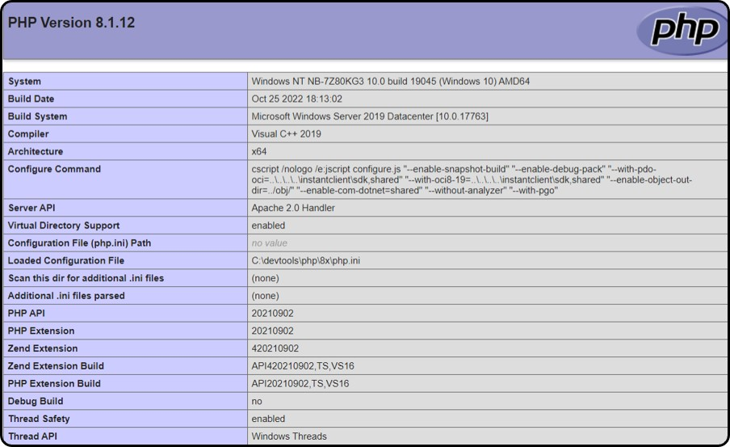
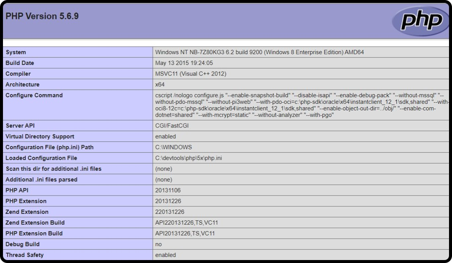

# Apache `HTTP` server

***
<!--

  DN  - domain name
  cdn - change domain name
  cdr - change directory name
-->

## Table of Contents
+ [ Change _localhost_ to a DN (domain name) ](#cdn)
  + [Re-directing _url_ to the computer](#cdna)
  + [Getting Apache to *redirect* the url to our source code directory](#cdnb)
+ [ Change document _root dr_ in Apache HTTP server ](#cdr)
+ [ How to run _PHP_ as an _Apache module_ ](#rPHPasApachemodule)
  + [PHP build](#PHPbuild)
  + [HTTP apache lounge](#apachelounge)
  + [Testing PHP file](#testphpfile)
+ [Setup multiple PHP build versions](#multiplePHPbuild)
  + [Download TS *(thread safe)* version](#downloadtsv)
  + [Configure php.ini](#configphp.ini)
  + [Apache configuration](#apacheconfiguration)
    + [Setup default PHP build version](#defaultPHPbuild)
    + [Fast CGI](#FastCGI)
    + [configure to use PHP build 5.6.9v](#usePHPbuild5.6.9v)
    + [Setup vhosts](#svhosts)

***

<a name="cdn"></a>
### `Apache HTTP Server:` change *localhost* to a *DN*
`In this section`, we want to change _localhost_ to access our  website / application. In this section we will use **`XAMPP`** package to install _`Apache distribution`_. _`XAMPP is the most popular PHP development environment`_. Installing XAMPP package allows us to _develop, execute, test, and play_ around with _web server source code_ on our local machine before we deploy the _source code_ on the _live server_. We can _configure and test_ out our website / application locally, instead of live web server somewhere. XAMPP is an easy way to install `Apache distribution`. It will install **`MariaDB, PHP, and Perl`**. [DOWNLOAD](https://www.apachefriends.org/download.html) and _start the installer_.

_We can configure Apache Server in `XAMPP` to serve up our web pages as though they were actually located on `http://www.our-web-site.com` instead of `localhost`._

This is the two steps process. First, we have to _redirect_ website / application _url_ to our computer. Secondly, we then get the Apache to *`redirect`* the _url_ to our source code _directory_.

[Re-directing _url_ to the computer](#cdna)
[Getting Apache to *redirect* the url to our source code directory](#cdnb)

<a name="cdna"></a>
##### Re-directing _url_ to the computer

When we _type_ and _search_ the website / application *`name/address/url`* into the web browser URL field _(Let’s say you type: http://www.our-web-site.com)_, the _web browser_ sends the provided _url_ to a _Domain Name Server_ that looks-up for text named _http://www.our-web-site.com_ and returns the _Internet Protocol (IP)_ address for it. Then, web browser connects to the _IP address_ it finds.

Before our web browser *`queries`* _DNS_. *Firstly* checks a file called *`hosts`* on our computer. If the requested *`url`* is found, then the web browser uses the *`IP address`* found in the file.

To re-direct _url_ to the computer:
+ Let's Locate our `hosts` file.
```sh
 C:\windows\system32\drivers\etc
```

+ Editing host file
  *Open the file with text editor like Notepad++.
  `Don’t use word processor because it can mess up the file when you save it`*.

+ Add `domain name(s) and IP address` to *redirect* to.
Each line must begin with the *IP address: 127.0.0.1*, then follow the *name of the domain* which we wish to _redirect_ to the _IP address_. **We can only enter one name per line**. Addresses names like _http://our-site.com and http://www.our-site.com_ are different and each need a separate line.  

  ```sh
  127.0.0.1 our-site.com
  127.0.0.1 www.our-site.com

  ```

<a name="cdnb"></a>
##### Getting Apache to *redirect* the url to our source code directory
+ Locate the *`httpd-vhosts.conf`* file.
```sh
C:\xampp\apache\conf\extra
```
+ Open the file using a _plain text file editor_ like Notepad++.
  `:warning: **Warning:** Don’t use word processor because it can mess-up the file when you save it`*.
```sh
<VirtualHost *:80>
    ServerAdmin admin@our-site.com
    DocumentRoot "C:/xampp/htdocs/dev-our-site.com"
    ServerName  our-site.com
    ServerAlias www.our-site.com

    # Other directives here
</VirtualHost>
```
|                    | Description                                          |
| ------------------ | ---------------------------------------------------- |
| *DocumentRoot* | *add the path where ur website / application source code is located. We can use an absolute path / relative path.*              |
| *ServerName*   | *add the name of the domain*                         |
| *ServerAlias*  | *We can add as many alternate domains (separated by spaces) as you like that are supposed to resolve to this virtual host.*     |

  *Remember that http://www.our-domain-site.com is different from http://our-domain-site.com, but we want them to be on the same web server.*

  _Save the file and restart the Apache Server for the changes to take effect. Do this by clicking on the Stop button on the XAMPP control panel and then clicking on the Start button. We could also just reboot the computer, but that is overkill_.

*` Last modified: 2023-07-08 time: 14:47PM `*

<a name="cdr"></a>
### `Apache HTTP Server:` change document root directory
The *web directory* is the home of all of our web based application's. `Document Root` on Apache web server is the _location / directory_ where to save files that are the source code of our website / application.

Now, to change the location of the `Document Root directory` to another document root configuration we have to open the file `httpd.conf`, usually the httpd.conf file located in the conf folder in Server Root directory. Since the `Server Root` on my computer is `C:/xampp/apache`, the `httpd.conf` file located in `C:/xampp/apache/conf/httpd.conf`.

+ Locate `httpd.conf file`: This will be `C:\xampp\apache\conf`
+ Open `httpd.conf` to edit using text editor.
  `Don’t use word processor because it can mess up the file when you save it.`

  After `httpd.conf` file is open, look for the string `DocumentRoot` on this file. We will find the configuration of Document Root in Apache web server. To change the location of the document root directory to another, `We simply replace the value of the document root configuration`.

  For instance: the location of the document root on my computer is in `C:/XAMPP/htdocs`, then we want to change it to `c:/workspace`, then we simply replace the line `DocumentRoot "C:/XAMPP/htdocs" to DocumentRoot "c:/workspace"` and the line `<Directory "C:/xampp/htdocs"> to <Directory "c:/workspace">`.

  ```sh
    cd c:/
    mkdir workspace
  ```
  ```sh
  DocumentRoot "C:/workspace"
  <Directory "C:/workspace">
      #
      # Possible values for the Options directive are "None", "All",
      # or any combination of:
      #   Indexes Includes FollowSymLinks SymLinksifOwnerMatch ExecCGI MultiViews
      #
      # Note that "MultiViews" must be named *explicitly* --- "Options All"
      # doesn't give it to you.
      #
      # The Options directive is both complicated and important.  Please see
      # http://httpd.apache.org/docs/2.4/mod/core.html#options
      # for more information.
      #
      Options Indexes FollowSymLinks Includes ExecCGI

      #
      # AllowOverride controls what directives may be placed in .htaccess files.
      # It can be "All", "None", or any combination of the keywords:
      #   AllowOverride FileInfo AuthConfig Limit
      #
      AllowOverride All

      #
      # Controls who can get stuff from this server.
      #
      Require all granted
  </Directory>

  ```

*After making changes to `httpd.conf` file is done, save the file, then restart Apache. To test whether the change is successful, we can open a web browser and visit http://localhost. If the results rendered by the web browser appears as shown in the image below, the changes made has been successful.*


*` Last modified: 2023-07-08 time: 15:18PM `*

<a name=""></a>
### `Apache HTTP Server:` Run PHP as an Apache module

+ [PHP build Thread Safe(TS)](#PHPbuild)
+ [HTTP apache lounge](#apachelounge)
+ [Testing PHP file](#testphpfile)

###### `PHP:` built-in web server
*In this section*, we'll be configuring PHP to run as an `Apache module`. However, PHP have *`built-in web server`* which can be launched by simply navigating into source code directory and run the *PHP executable command* with an `-S parameter` to set the localhost and port number.

```sh

mkdir dev-test
cd dev-test

# Start php built-in web server
php -S localhost:8001

```
PHP content file can be accessed in a browser at [*http://localhost:8001*]( http://localhost:8001)

If we are `running multiple sites` using `PHP built-in web server`, we will have to specify different port for each site:

```sh

  php -S localhost:8001 # /site1
  php -S localhost:8002 # /site2
  php -S localhost:8003 # /site3

```
###### `PHP:` Build Thread Safe(TS)
To Install PHP build Thread Safe(TS) on our system: three steps process:

+ `Step 1:` Download `PHP build Thread Safe (TS) zip package`. This PHP build is for single process web servers. Windows PHP builds can be download from [PHP builds](https://www.php.net/downloads.php)

+ `Step 2:` Extract PHP build Thread Safe (TS) zip package. PHP can be installed anywhere on our system. This means we can extract PHP build files at any directory of our choice. In this section, we will extract PHP build files in `c:/devtools/php/8.3.2`

  ```sh
  # 8.3.2 is php version
  mkdir 8.3.2
  cd 8.3.2

  ```
  
+ `Step 3:` PHP build configuration setting.

  The main PHP build configuration file is named `php.ini`. This file doesn’t exist initially, so we have to *copy and paste* `php.ini-development` and *rename* it to `php.ini`. This PHP’s configuration file contain default configuration which provides a development setup which reports all PHP errors and warnings. However, PHP does allow some setting to be set within a PHP script using method called `ini_set()`.

  As we built our project, we will enable any required `php extensions / module`. This will depend on the libraries we need to use for `functional requirements`. The extensions below aren't enabled by default. This will provides suitable development environment or production environment for most of our web applications:

  ##### *configure php.ini*
  *Now* open `php.ini` file and remove the semicolon `;` from the `extension_dir = "ext"` setting.
  _Usually_, we would want to have `cURL`, `gd`, `mbstring`, `fileinfo`, and `pdo_sqlite` enabled. Search and remove the semicolon `;` for any extensions we need to start.

  ```sh
    # remove ; )

    extension_dir = "ext"

    extension=curl
    extension=gd
    extension=fileinfo
    extension=mbstring
    extension=pdo_mysql

  ```

##### `PHP:` System variable
To ensure Windows system can find the executable PHP file .exe, we need to add the PATH environment variable: `PATH: c:/devtools/php/8.3.2`.
+ In Search, search for and then select: System (Control Panel)
+ Click the *`Advanced system settings`* link.
+ Click Environment Variables. In the section *`System Variables`* find the PATH environment variable and select it. Click *`Edit`*. If the PATH environment variable does not exist, *`click New`*.
+ In the *`Edit System Variable (/ New System Variable)`* window, specify the value of the PATH environment variable. Click OK. Close all remaining windows by clicking *`OK`*.
+ Re-open *command prompt* window, and *run* PHP executable *command* with `-v parameter` below that allows us to check the *php version* install.

```sh
  # check php version installed
  php -v
```

<a name="apachelounge"></a>
##### HTTP Apache lounge
To install HTTP Apache, we download the latest Win64 ZIP file from [Apache lounge](https://www.apachelounge.com/download/) and *extract* it to any directory of our choice. Our directory will be. `c:\devtools\apache`.

There are three ways to set up PHP to work with Apache 2.x on Windows. PHP can be run as a: `handler`, as a `CGI`, or under `FastCGI`.

To configure PHP as an Apache HTTP server module, we ensure that Apache HTTP server isn’t running, if was started, we have to stop it from running. To perform this configuration we open and edit main Apache HTTP server configuration file called `httpd.conf`. According to our installation PATH in this section, the location of this file is: `c:\devtools\apache\conf\httpd.conf`. Add the following lines to the bottom of the `Apache httpd.conf configuration` file to set PHP as an Apache module.

###### Installing PHP as an Apache handler.

```sh
# The name of the module for PHP 8.x.x is php_module
# For PHP 7.X.X the module is php7_module

LoadModule php_module "c:/devtools/php/8.3.2/php8apache2_4.dll"
# LoadModule php7_module "c:/devtools/php/7.x/Win64/php7apache2_4.dll"
<FilesMatch \.php$>
    SetHandler application/x-httpd-php
</FilesMatch>

# AddType can also be used in place of using
# FilesMatch with SetHandler.
#
# AddType application/x-httpd-php .php

# configure the path to php.ini
PHPIniDir "c:/devtools/php/8.3.2"

```

###### Configure Apache to run PHP as FastCGI

```sh
LoadModule fcgid_module modules/mod_fcgid.so
# configure the path to php.ini
FcgidInitialEnv PHPRC "c:/devtools/php/8.3.2"
<FilesMatch \.php$>
    SetHandler fcgid-script
</FilesMatch>

FcgidWrapper "c:/devtools/php/8.3.2/php-cgi.exe" .php
```

In the same file, also change the `DirectoryIndex` setting to load `index.php` instead of `index.html` when it can be found.

```sh

<IfModule dir_module>
    DirectoryIndex index.php index.html
</IfModule>

```

When done editing, save `httpd.conf` file changes and then test our configuration from a `cmd` command line. We use `httpd -t` command test if there is errors with our configuration. if `Syntax OK` displayed, it means configuration has been done correctly. If all went well, restart Apache with httpd. To execute `httpd command` any where on Windows system, add `c:\devtools\Apache24\bin` to the system path environment variable.

*Open command prompt to start Apache with:*

```sh

httpd -v
httpd -t
httpd -w

```
| Command  |    Definition                |   
|----------|------------------------------|
| httpd -v | Version                      |
| httpd -t | Test if no errors            |
| httpd -w | Start the server             |
| CTRL + c | To stop server from running  |

<a name="testphpfile"></a>
##### Testing PHP file
Let's create a PHP file called `index.php` in Apache’s web directory root folder at `c:\devtools\apache\htdocs` and add the following PHP source code:

###### Add phpinfo() on index.php
```sh
<?php

echo phpinfo();

```


*Open a web browser and enter your server address: [http://localhost:8080](). A PHP version page will appear showing the various PHP and Apache configuration settings.*

*` Last modified: 2023-07-08 time: 16:38PM `*

<a name="multiplePHPbuild"></a>
### `Apache HTTP Server:` Setup multiple PHP build versions

##### `PHP:` Download TS (thread safe) version
In this section, we will install two different versions of PHP build. PHP 8.1.12 build has already been installed on our previous section above where we configer `php build thread safez(TS)` to run as a module.
<a name="downloadtsv"></a>*Firstly,* we’ll need to [*download TS (thread safe) version*](https://windows.php.net/downloads/releases/archives/) to install `PHP 5.6.9 build` to work along-side with `PHP 8.1.12 build`. Each `PHP version build` installed will be `configured` on *per-project directory requirements*.

Before downloading `PHP build version`, let's check if we have `Thread Safety` enabled in our current *PHP* installation by executing `phpinfo()`
build-in function inside our `C:\devtools\apache\htdocs\index.php` directory as shown on the previous section above. *Now* search for `Thread Safety` and *verify* if we have enabled it or not. *If we have `Thread Safety enabled`, then we should download the PHP build version that contain `Thread Safety` in it's name. And opposite will be the case with,
if we have `Non-Thread Safety enabled`, you should download the version that contains `Non-Thread Safety` in it's name.*

*Once* the [download finishes](https://windows.php.net/downloads/releases/archives/), we go to `C:\devtools\php` directory and create a new `PHP folder` called 5x. *Then*, we open the archive PHP build TS (thread safe) version we’ve downloaded and *extract* everything in this folder: 5x.

```sh
# Create directory to extract PHP build TS (thread safe).
mkdir 5.6.9

```

<a name="configphp.ini"></a>
##### `PHP:` *configure php.ini*
In the same directory 5x, locate the `php.ini-development` file. _Copy, paste and rename_ it to php.ini. Open the `php.ini` file and remove the semicolon `;` from the `extension_dir = "ext"` setting.
_Usually_, we would want to have `cURL`, `FTP`, `fileinfo`, `MySQL`, `MySQLi`, `openssl`, and `pdo_sqlite` enabled. Search and remove the semicolon `;` for any extensions we need to start.

```sh
# remove ; )
extension_dir = "ext"
```

<a name="apacheconfiguration"></a>
#### Apache configuration
<a name="defaultPHPbuild"></a>
###### Set default PHP build (thread safe) version
Everything looks good, it’s time to configure our default `PHP 8.1.12 build`.  Go to `C:\devtools\apache\conf` to locate file named `httpd.conf`. Enable Various default settings. It's not enable by default. Search and remove #.

```sh
# Remove # )
Include conf/extra/httpd-default.conf
```

Now, go to `C:\devtools\apache\conf\extra` to locate file named `httpd-default.conf`. Preferably at the end of  `httpd-default.conf` file, add the following chunk of source code below:

```sh
# Installing PHP as an Apache handler.
# The name of the module for PHP 8.x.x is php_module.
# For PHP 7.X.X the module is php7_module.

LoadModule php_module "c:/devtools/php/8x/php8apache2_4.dll"
# LoadModule php7_module "c:/devtools/php/7.x/Win64/php7apache2_4.dll"
AddType application/x-httpd-php .php

# FilesMatch with SetHandler can also be used in place of using AddType
#
# <FilesMatch \.php$>
#    SetHandler application/x-httpd-php
# </FilesMatch>

# configure the path to php.ini
PHPIniDir "c:/devtools/php/8.3.2"

```
*Open command prompt to stop, test and start Apache to see if changes are successful:*

```sh
# To stop apache server press CTRL + c
httpd -t
httpd -w

```
<a name="FastCGI"></a>
###### Fast-CGI
##### `PHP:` Download FastCGI
Apache in itself can’t run multiple PHP buld versions. So, what we’re going to do is update it to use `Fast CGI` server API instead of Apache 2.0 handler. We can [*download*](https://www.apachelounge.com/download/) Fast CGI. We will download `mod_fcgid-2.3.10-win64-VS16.zip` based on our apache architecture. Once downloaded, extract the zip file and copy `mod_fcgid.so` file to `c:\devtools\apache\modules` directory. And enable fcgid_module on the main Apache HTTP server configuration file called `httpd.conf` as shown below. Search and remove the Pound sign #

```sh
# Remove # or add it if isn't available.
LoadModule fcgid_module modules/mod_fcgid.so

```
###### Configure apache to use PHP build (thread safe) version 5.6.9
*Now*, to let Apache know that we have a new PHP build (thread safe) version 5.6.9 version ready to be used. We open and edit main Apache HTTP server configuration file called `httpd.conf`. According to our installation PATH in this section, the location of this file is: `c:\devtools\apache\conf\httpd.conf`. _Add_ the source code bellow to the bottom of the file. This will tell Apache where to find our specific PHP build (thread safe) version.

```sh

# Configure Apache to run PHP as FastCGI
# PHP 5.6.9
# Not default PHP build (thread safe) version in this case.

ScriptAlias /php5.6.9 "C:/devtools/php/5.6.9"
Action application/x-httpd-php5.6.9-cgi /php5.6.9/php-cgi.exe

<Directory "C:/devtools/php/5.6.9">
    AllowOverride None
    Options None
    Require all denied

    <Files "php-cgi.exe">
        Require all granted
    </Files>

    SetEnv PHPRC "C:/devtools/php/5.6.9"
</Directory>

```

<a name="usePHPbuild5.6.9v"></a>
#### Test project

Now, in every project directory that we want to use PHP build (thread safe) version 5.6.9 we must include the code below on our virtualhost configuration on `c:\devtools\apache\conf\extra\httpd-vhosts.conf`.
```sh

UnsetEnv PHPRC
<FilesMatch "\.php$">
    SetHandler application/x-httpd-php5.6.9-cgi
</FilesMatch>

```

<a name="svhosts"></a>
#### `Test project:` Setting up virtual host

`httpd-vhosts.conf` is not it's not enable by default. Go to `C:\devtools\apache\conf` to locate file named `httpd.conf`. Search and remove #.
```sh
# Virtual hosts
Include conf/extra/httpd-vhosts.conf

```
*Then open* `c:\devtools\apache\conf\extra\httpd-vhosts.conf` and Add the source code below at the bottom of the file.

```sh

<VirtualHost test.local:80>
    DocumentRoot "C:\devtools\apache\htdocs\test"
    ServerName test.local
    ServerAlias www.test.local
    <Directory "C:\devtools\apache\htdocs\test">
        Allow from all
        Require all granted
        Options Indexes # FollowSymLinks Includes ExecCGI
        AllowOverride All
    </Directory>
    UnsetEnv PHPRC
    <FilesMatch "\.php$">
        SetHandler application/x-httpd-php5.6.9-cgi
    </FilesMatch>
</VirtualHost>

```

*Now,* go to `C:\devtools\apache\htdocs` and create project directory called `test` and file called `index.php`, then add `phpinfo()` build-in function on index.php file as shown below:

```sh

mkdir test
cd test
touch index.php

```

###### Add phpinfo() on index.php

```sh
<?php

 echo phpinfo();

```

+ [http://localhost/test](http://localhost/test) -> PHP build 5.6.9
+ [http://localhost](http://localhost:8080/)  -> PHP build 8.1.12



*` Last modified: 2024-02-04 time: 18:28PM `*
